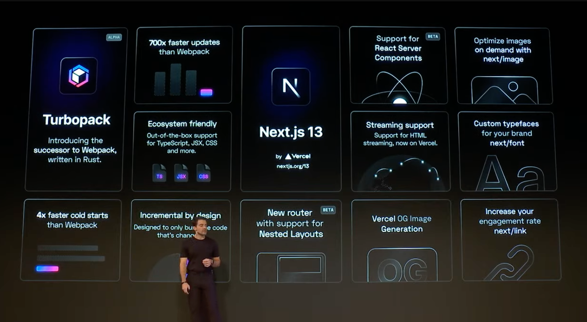

On October 25, Vercel held their flagship [Next.js Conf](https://nextjs.org/conf) event - with two big announcements. The screenshot below summarized the key announcements - we can dive into some details next.


---

## 1. Turbopack

[Turbopack](https://nextjs.org/blog/next-13#introducing-turbopack-alpha) is a Rust-based successor to Webpack, using [SWC](https://swc.rs/) - a Rust-based platform for the Web - to build fast developer tools.

The current **alpha release** is 700x faster than Webpack and has out-of-the-box support for [the following features](https://turbo.build/pack/docs/features). 
- JavaScript, TypeScript, JSX/TSX,  CSS
- Imports & Environment Variables
- DevServer with Hot Module Reloading 
- Frameworks - with Server Components 
- Static Assets 

The current [roadmap](https://turbo.build/pack/docs/roadmap) has Turbopack used as an **opt-in feature** for Next.js dev server with plans to work with other frameworks. Try it in Next.js 13:

```js
$ next dev --turbo
```
---

## 2. Next.js 13

The other big announcement is the release of [Next.js 13](https://nextjs.org/blog/next-13) with [beta documentation](https://beta.nextjs.org/docs). This release:
 - adds new router support for [Nested Layouts](https://nextjs.org/blog/next-13#layouts)
 - adds support for [React Server Components](https://nextjs.org/blog/next-13#server-components)
 - provides support for [HTML Streaming](https://nextjs.org/blog/next-13#streaming)
 - launches an OG Image Generation feature
 - optimizes images on-demand with [`next/image`](https://nextjs.org/blog/next-13#nextimage)
 - custom typefaces and self-hosted fonts with [`next/font`](https://nextjs.org/blog/next-13#nextfont)
 - increases engagement rate with simplified [`next/link`](https://nextjs.org/blog/next-13#breaking-changes) API

Upgrade to Next.js 13 using:

```js
$npm i next@latest react@latest react-dom@latest eslint-config-next@latest
```

Let's dig into some of these.

---

## 3. Routing & Layouts

:::tip APP DIRECTORY PLAYGROUND
Explore the new features using [this playground](https://vercel.com/templates/next.js/app-directory) - deploy on server, or [run locally](https://github.com/vercel/app-playground)
:::

Next.js uses a zero-config filesystem-based router (file hierarchy maps to route paths) based on `pages/` folder. 

With Next.js, you _also have_ an `app/` directory option that lets you maintain state across navigations and enable advanced routing patterns.
 - Routes in `app/` take precedence over `pages/`.
 - Components in `app/` _default_ to [React Server Components](https://beta.nextjs.org/docs/rendering/server-and-client-components) 
 - Components in `app/` _can use_ [Client Components](https://beta.nextjs.org/docs/rendering/server-and-client-components#client-components) if desired.
 - **Folders** can be nested to create route segments in URL path.
 - **Files** in folder create the UI shown for that route.
     
 - **Special Files** define unique capabilities when name is used. Ex: `page` defines unique UI for that route, `layout` defines UI that can be _shared_ across pages, `loading` defines UI for first load, `error` defines isolated UI for error info, `template` is reusable UI _without state sharing_, `head` defines _head metadata_ for that page.
    

Read [Routing Fundamentals](https://beta.nextjs.org/docs/routing/fundamentals) for more on _server-centric routing_, _partial rendering_ and _advanced routing patterns_.

---

## 4. React Server Components

The `app/` directory unlocks support for [React Server Components](https://vercel.com/blog/everything-about-react-server-components) - the default implementation for UI on these routes - which reduces JS sent to the client for faster initial load times. With this architecture:
 * server-side components are pre-rendered and delivered to client with minimal JS.
 * client components can be rendered at client, or (with Next.js) be _pre-rendered_ on server and _hydrated_ on client.

To use a Client component add a `use client` directive as first line of code in UI file. Server-side rendering is the default. To understand which option is best for a given context, read [when to use client vs. server components](https://beta.nextjs.org/docs/rendering/server-and-client-components#when-to-use-server-vs-client-components).

---

## 5. Streaming & Data Fetching

Next.js 13 uses a _new data fetching_ approach aligned to React and the Web Platform best practices. Now, **in the /app folder** APIs like `getServerSideProps`, `getStaticProps` and `getInitialProps` are **NOT** supported. Instead, 
 * data is fetched _within Server Components_, always on the server.
 * fetch data directly within the component that needs it (no pass-down as props)
 * take advantage of native `fetch()` web API and `async/await` semantics.
 * uses static data fetches by default (data that changes slowly or rarely) - but allows you to _mark requests as dynamic_ to enforce fetch at request time.

Next.js 13 takes advantage of [Streaming and Suspense](https://beta.nextjs.org/docs/data-fetching/fundamentals#streaming-and-suspense) features in React for progressive rendering and incremental rendering of UI units (with _loading state_ shown for parts that are still fetching data).

Next.js also supports data _caching_ and _revalidation_, as well as _sequential and parallel_ data fetching options.

---

## 6. The `next/image` Component

Provides improved [Core Web Vitals](https://web.dev/learn-core-web-vitals/) with less client-side JS, easier styling, improved accessibility and faster loads.

Images using this component are responsive by default and use modern image formats. Use the relevant [Next.js Codemods](https://nextjs.org/docs/advanced-features/codemods) to refactor legacy image components to handle deprecation when moving to Next.js 13.


---

## 7. The `next/font` Component

Automatically optimizes fonts and reduces external network requests - font files are downloaded at build time and _self-hosted_ with your static assets. This lets you use Google Fonts with _performance and privacy in mind_ - no requests sent to Google from the browser!

Get started by installing the component, then [explore the docs](https://nextjs.org/docs/basic-features/font-optimization).

```
$ npm install @next/font
```

---

## 8. The `next/link` Component

Client-side route transitions (navigation) are handled by the `Link` component which accepts `href` (address), `scroll` (behavior) amd other _props_ for rendering. The new component simplifies the API even further to handle popular requirements.

---

## 9. OG Image Generation

Adds a library to make generation of **dynamic** social media cards (_OpenGraph images_) easier using _Edge Functions_.

This not only helps create _metadata_ that improves SEO and engagement with content, it can help with _creation of image fixtures_ for testing (like `faker.js`) in ways that align with real-world requirements.


---

## 10. Middleware API Updates

[Middleware](https://nextjs.org/docs/advanced-features/middleware) provide interception capabilities in routers, letting you run code before requests are completed - or modify responses after - to support enhanced use cases.

To use middleware, create a `middleware.js` file in the _root_ of the `src/` directory and export functions from it. These will get involved for **every route in your project** [in a specified order](https://nextjs.org/docs/advanced-features/middleware#matching-paths) -- with `matcher` properties providing _filter_ options that constrain functions to run only on specific paths.

With Next.js 13 you can set headers on requests, and provide direct responses, directly from middleware functions.

---

:::info NEXT STEPS
In the next post, I'll start with some basic Next.js quickstarts (pre-13) to familiarize myself with _current_ behaviors, then revisit Next.js 13.
:::